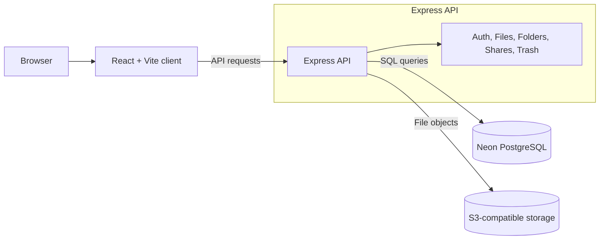

# StoreMyFiles

StoreMyFiles is a full-stack cloud storage application. Users can create folders, upload files, preview supported files, rename and move items, share files, and restore deleted items from the trash.

The frontend and backend are intentionally separated: a React client and an Express API.

## Contents

- [Demo](#demo)
- [Features](#features)
- [Tech stack](#tech-stack)
- [Architecture](#architecture)
- [Project structure](#project-structure)
- [Requirements](#requirements)
- [Local development](#local-development)
- [Available scripts](#available-scripts)
- [Environment configuration](#environment-configuration)
- [Security notes](#security-notes)
- [License](#license)

## Demo

[Open the live demo](https://storemyfiles.vercel.app/login)

## Features

- User registration, login, logout, and protected routes
- File upload with upload progress
- Folder creation and navigation
- File preview, rename, move, and delete actions
- Trash and restore functionality
- Shareable file links
- Search and sort controls
- S3-compatible object storage

## Tech stack

### Frontend

- React
- Vite
- React Router
- Axios
- Tailwind CSS

### Backend

- Node.js
- Express
- PostgreSQL through Neon
- S3-compatible object storage
- JWT authentication

## Architecture



## Project structure

```text
client/
	src/                 React application
	public/              Static frontend assets
	vite.config.js       Vite configuration
	vercel.json          SPA route rewrites for Vercel

server/
	config/              Database and storage configuration
	controllers/         API request handlers
	middleware/          Authentication and upload middleware
	routes/              API route definitions
	services/            Storage services
	server.js            Express application entry point

```

## Requirements

- Node.js 20 or newer
- A Neon PostgreSQL database
- An S3-compatible storage bucket

## Local development

Install dependencies in both applications:

```bash
cd client
npm install

cd ../server
npm install
```

Create local environment files from the included examples:

```text
client/.env.example  ->  client/.env
server/.env.example  ->  server/.env
```

Set the database, authentication, CORS, and storage values in `server/.env`. The client uses `http://localhost:3000` by default; change `VITE_BASE_URL` in `client/.env` when the API runs at another address.

Start the API in one terminal:

```bash
cd server
npm run dev
```

Start the frontend in a second terminal:

```bash
cd client
npm run dev
```

Open `http://localhost:5173` in a browser.

## Available scripts

Run these commands from the corresponding directory:

| Directory | Command           | Purpose                               |
| --------- | ----------------- | ------------------------------------- |
| `client`  | `npm run dev`     | Start the Vite development server     |
| `client`  | `npm run build`   | Create a production frontend build    |
| `client`  | `npm run preview` | Preview the production frontend build |
| `client`  | `npm run lint`    | Run frontend lint checks              |
| `server`  | `npm run dev`     | Start the API with automatic reload   |
| `server`  | `npm start`       | Start the API for production          |

## Environment configuration

<details>
<summary>View environment variables and configuration</summary>

Use [client/.env.example](client/.env.example) and [server/.env.example](server/.env.example) as references. Do not commit `.env` files or real credentials.

The most important settings are:

- `VITE_BASE_URL`: public URL of the deployed backend
- `DATABASE_URL`: Neon PostgreSQL connection string
- `JWT_SECRET`: long random authentication secret
- `ORIGINS`: exact public frontend origin
- `AWS_REGION`, `AWS_ENDPOINT_URL_S3`, `AWS_ACCESS_KEY_ID`, `AWS_SECRET_ACCESS_KEY`, and `AWS_S3_BUCKET`: storage configuration

</details>

## Security notes

- Keep all credentials in hosting-provider environment variables.
- Use a unique, long `JWT_SECRET` in production.
- Restrict `ORIGINS` to trusted frontend domains.
- Do not commit local `.env` files, access keys, or database URLs.

## License

This project is released under the MIT License.
